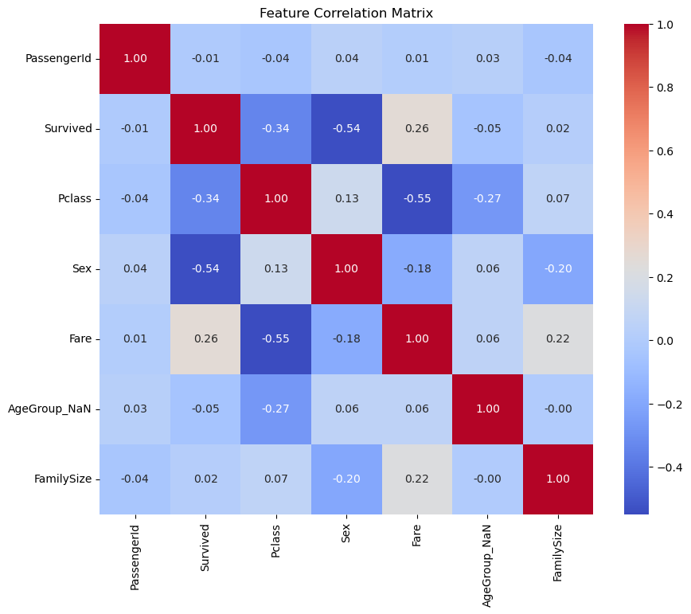

# 7.11 기록
(7.10일에는..딱히 진전된 바가 없어서 skip;;)

### 데이터 전처리
< 결측치 처리 > 

Age 결측치 처리 : 

```python
title_list=['Mrs', 'Mr', 'Master', 'Miss', 'Major', 'Rev',
                    'Dr', 'Ms', 'Mlle','Col', 'Capt', 'Mme', 'Countess',
                    'Don', 'Jonkheer'
                    ]

def replace_titles(x):
    title=x['Title']
    if title in ['Don', 'Major', 'Capt', 'Jonkheer', 'Rev', 'Col']:
        return 'Mr'
    elif title in ['Countess', 'Mme']:
        return 'Mrs'
    elif title in ['Mlle', 'Ms']:
        return 'Miss'
    elif title =='Dr':
        if x['Sex']=='0':
            return 'Mr'
        else:
            return 'Mrs'
    else:
        return title
    
```
호칭 별로 평균 나이 계산 -> 이후 결측치에 대체하여 활용

**features??** 
| Index | Feature         | 설명                                  |
|-------|-----------------|---------------------------------------|
| 0     | Pclass          |                                       |
| 1     | Sex             |                                       |
| 2     | Age             |                                       |
| 3     | Fare            |                                       |
| 4     | FamilySize      | SibSp + Parch + 1                     |
| 5     | F/F             | Fare / FamilySize                     |
| 6     | FareGroup_Sex   | Fare별로 4 group 만든 후 성별 반영     |
| 7     | Deck            |                                       |

## Model?
- RadmonForest 
- XGBoost
- Stacking : RandomForest + XGBoost
- Staking : RandomForest * 5 => 최고점(7.11 제출)

## Think?~


- 성별에 대해서 하나의 feature로 바라보는 것 보다, 범주형 데이터에 성별 방향을 곱해서 새로운 feature를 고려해 보는 것은?!
    - ex. 나이 분포를 범주화 하고 나서 이후에 성별방향을 곱해보자